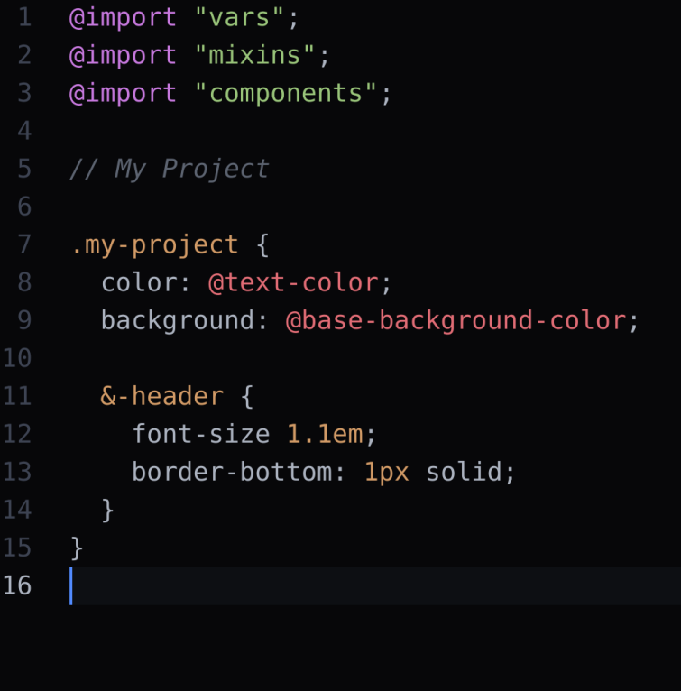

## One Black Syntax theme

[one-dark-syntax](https://github.com/Adimote/one-black-syntax/raw/master/demo.png), but modified to be almost black

modified to be even darker, for OLED displays

There is also a matching [UI theme](https://atom.io/themes/one-dark-ui).

### Install

add this theme by pasting the github url into the install search box
